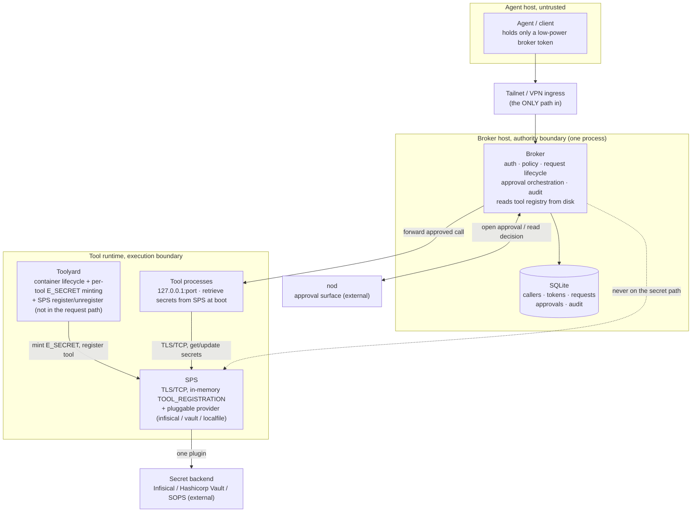
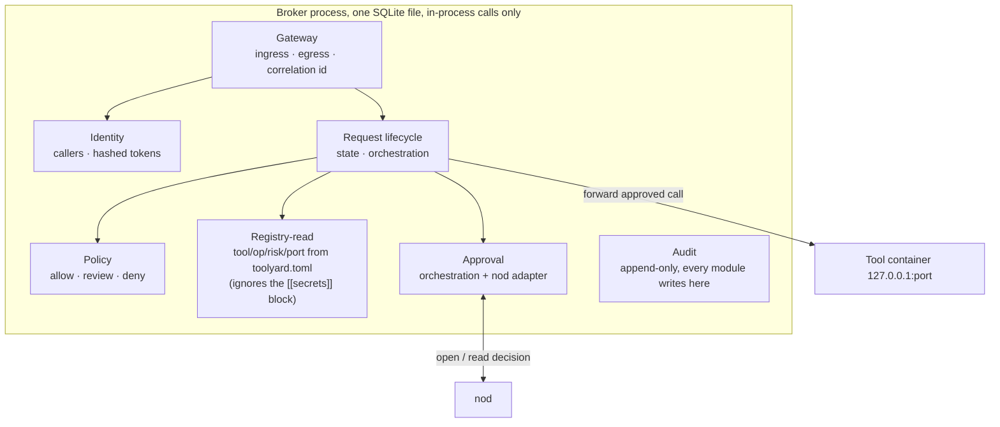

# Architecture

How the system works, and why. Read [PROJECT.md](../PROJECT.md) for the summary
and [plan.md](../plan.md) for the buildable, component-by-component plan.

**Direction:** the system is *collapsed to deployment reality*, a few processes
with hard physical boundaries, not a mesh of logical services. The detailed
ownership rules live as **module seams inside the broker** (second diagram).

## Physical picture (the boundary is the architecture)

Typically the broker, toolyard, SPS, and tool containers all run on **one host**,
isolated by process and container boundaries and bound to `127.0.0.1`. The tailnet
is the only way in; nod and the secret backend are the only things reached out to.

The request path is broker → tool container **directly** on the tool's
loopback port; the broker reads the per-tool `X-Toolstack-Secret` channel
credential (the E_SECRET the runner minted) from the host-local toolyard
state file. Tools do not see the broker or the backend — they see only
SPS, over TLS/TCP.

## Inside the broker (module seams)

These are modules in one process, not services. Each keeps the ownership rule it
had when it was a "service" (see the module table in [plan.md](../plan.md)). They
share one SQLite file and call each other in-process: **no network and no
inter-module auth**, which is exactly the cost the collapse removes. Every module
records to the Audit module.

## Trust boundaries

| From → To | Path | Auth |
|---|---|---|
| Agent → Broker | Tailscale Serve (tailnet-only) | Bearer token bound to one caller |
| Broker → Tool container | localhost HTTP / JSON-RPC | Optional per-tool `X-Toolstack-Secret` (re-sourced from each tool's E_SECRET — Phase 4) |
| Toolyard → SPS | TLS/TCP, one JSON line per direction | In-body `spsecret` (mode 0600 enforced on `/etc/toolstack/sps.env`); server cert verified against `SP_TLS_CA` |
| Tool → SPS | TLS/TCP, one JSON line per direction | In-body `esecret` (the runner-minted per-tool channel credential, hex ≥ 32 chars); same CA verify |
| SPS → Backend | per-plugin | plugin handles its own credential |
| Broker → nod | HTTP over tailnet | nod issuer token (on the broker host) |
| nod → Broker (callback), *not implemented, not planned* | - | No callback route exists; resolution is poll-only. Rejected on security grounds: nod posts callbacks unauthenticated, so a receiver would let anyone forge an approval. |
| Operator → Broker | CLI on the host | Direct SQLite / `brokerctl` |
| Operator → SPS | `python3 -m sps.cli` on the host (init / vault-set / vault-get) | The `sps.env` mode + a service account on the host |

## What holds the line

The controls live in the [security-spine invariants in plan.md](../plan.md): fail
closed; secrets never on the control plane; registry secret-unaware (physically);
redact before any boundary; tokens hashed and revocation immediate; approval
describes the operation; the broker owns approval truth; every decision audited.

## Why it's shaped this way

The agent can reach only the broker, over one tunnel. The broker decides. The tool
executes with its own secrets, which the broker never sees. Risky operations go to
nod for a human. One host, localhost binding, and a tailnet keep the whole thing
deployable on a laptop and auditable end to end, while the broker's internal
module seams keep the roles from collapsing into one tangled blob.
