# Component Diagram

See [component-io-contracts.md](component-io-contracts.md) for higher-level
component consume/produce boundaries, and [message-contracts.md](message-contracts.md)
for transport-neutral message contracts between components and trust zones.

```mermaid
flowchart TB
    subgraph AgentZone["External Agent / Client Zone"]
        Agent["Agent Runtime / Client App<br/>holds client id + profile token"]
    end

    subgraph AdminZone["Admin Operator Zone"]
        Control["Control Panel<br/>admin client, owns no primary state"]
    end

    subgraph CoreZone["Core Control Plane Trust Zone"]
        Gateway["BrokerGateway<br/>request ingress and response egress"]
        Profiles["ClientProfileService<br/>clients, profiles, profile tokens"]
        Requests["RequestService<br/>mutable request lifecycle"]
        Policy["PolicyService<br/>tool authorization, policy bindings, grants"]
        Registry["ToolRegistryService<br/>tool catalog, operations, risk hints<br/>no secret awareness"]
        Approval["ApprovalService<br/>approval workflow state and outcomes"]
        ApprovalEndpoint["Approval Surface Endpoint<br/>external approval ingress/egress boundary"]
    end

    subgraph ApprovalZone["External Approval Surface Zone"]
        Messaging["Messaging Apps<br/>Discord, Matrix, ntfy, mobile"]
        ApprovalAgents["Approval Agent Runtimes<br/>agentic review or escalation"]
        Humans["Human Approvers"]
    end

    subgraph RuntimeZone["Tool Runtime Trust Zone"]
        Runtime["ToolRuntimeService<br/>tool instances, execution, backend selection, health"]
        ToolA["Tool Instance A<br/>expects its own env/files/keys"]
        ToolB["Tool Instance B<br/>expects its own env/files/keys"]
    end

    subgraph SecretsZone["Secrets Trust Zone"]
        Secrets["SecretsManagementService<br/>secret namespaces, component credentials,<br/>profile/tool bindings, materialization, writeback"]
        WorkloadSecrets["Workload Secret Backends<br/>SOPS, sqlite, Infisical, 1Password, etc."]
        ComponentSecrets["Component-to-Component Secrets<br/>service tokens, signing keys, certs"]
    end

    subgraph MonitoringZone["Monitoring / Audit Trust Zone"]
        Monitoring["ToolMonitoringService<br/>append-only audit and event history"]
        LogStore["Audit Event Store<br/>query, retention, export"]
    end

    Agent -->|"action request<br/>client id + profile token"| Gateway
    Gateway -->|"authenticate profile token"| Profiles
    Gateway -->|"submit request context"| Requests

    Requests -->|"tool + operation lookup"| Registry
    Requests -->|"authorization decision"| Policy
    Requests -->|"open approval when required"| Approval
    Requests -->|"execute approved/allowed request"| Runtime

    Approval <-->|"approval workflow state"| ApprovalEndpoint
    ApprovalEndpoint <-->|"surface protocol adapter"| Messaging
    ApprovalEndpoint <-->|"agentic approval adapter"| ApprovalAgents
    Humans -->|"approve / reject / comment"| Messaging

    Runtime -->|"materialize secrets for profile + tool"| Secrets
    Secrets -->|"load / write workload secrets"| WorkloadSecrets
    Secrets -->|"issue / rotate component credentials"| ComponentSecrets
    Runtime -->|"prepared execution context"| ToolA
    Runtime -->|"prepared execution context"| ToolB

    Control -.->|"manage clients and profiles"| Profiles
    Control -.->|"manage policies and grants"| Policy
    Control -.->|"manage tool catalog"| Registry
    Control -.->|"manage approvals"| Approval
    Control -.->|"manage runtime instances"| Runtime
    Control -.->|"manage namespaces and component credentials"| Secrets
    Control -.->|"view logs"| Monitoring

    Profiles -.->|"component auth material"| Secrets
    Policy -.->|"component auth material"| Secrets
    Approval -.->|"component auth material"| Secrets
    Runtime -.->|"component auth material"| Secrets
    Monitoring -.->|"component auth material"| Secrets

    Requests -->|"request lifecycle events"| Monitoring
    Policy -->|"policy decision events"| Monitoring
    Approval -->|"approval events"| Monitoring
    Runtime -->|"runtime and execution events"| Monitoring
    Secrets -->|"materialization and credential events"| Monitoring
    Monitoring -->|"persist events"| LogStore

    Registry -.->|"does not declare namespaces or keys"| Secrets
```

## Threat Model Notes

- `BrokerGateway` is the only normal entry point for agent/client action requests.
- `BrokerGateway` only talks to `ClientProfileService` and `RequestService`; it has no direct secrets path.
- `Approval Surface Endpoint` is a separate external boundary because messaging apps and approval-agent runtimes live outside the core system.
- `SecretsManagementService` covers both workload secrets and component-to-component credentials.
- `ToolRegistryService` never declares secret namespaces, secret keys, or secret requirements.
- `ToolRuntimeService` asks for secrets using the active profile/tool execution context.
- `ToolMonitoringService` receives events from every domain but does not own mutable request state.
