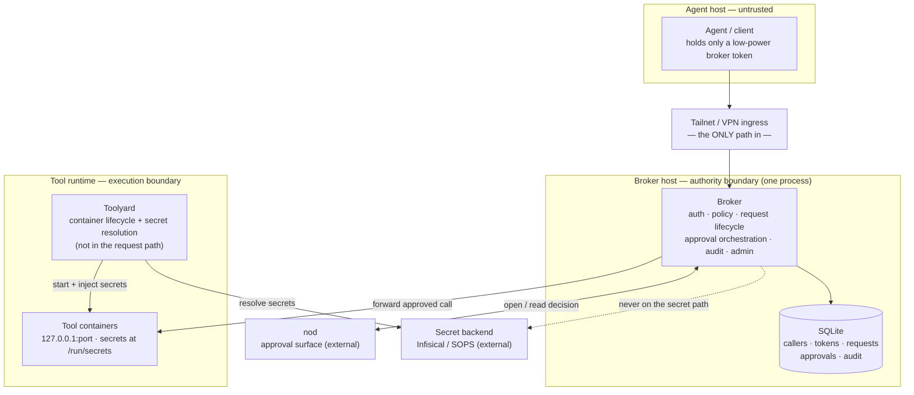

# Toolstack — Walkthrough & Review

A self-contained review of where the project stands after Phases 0–4. Read this to
re-orient, verify the work is sound, and decide what's next. Companion docs:
[PROJECT.md](../PROJECT.md) (nerve center), [plan.md](../plan.md) (build plan),
[component-decomposition.md](component-decomposition.md) (architecture).

## TL;DR

The planned build order (Phases 0–4) is **complete and tested**, and the agent-side
client (the `toolstack` CLI + MCP adapter + skill) is built on top — 106 tests pass
(83 broker + 8 toolyard + 15 client) plus an opt-in Docker end-to-end, and every phase has a
live demo. The full vertical slice runs:

> **agent → broker (auth + policy) → human approval in nod → tool execution with
> its own workload secrets — and the broker never sees a secret.**

It's all zero-dependency Python (Docker only for the production tool runner),
runnable with `python3`. It is **not yet deployment-hardened** — see
[Deferred & caveats](#deferred--caveats) before running it anywhere real.

## Contents

1. [The one idea](#the-one-idea)
2. [Architecture at a glance](#architecture-at-a-glance)
3. [What's built](#whats-built)
4. [The request lifecycle, end to end](#the-request-lifecycle-end-to-end)
5. [Security properties & evidence](#security-properties--evidence)
6. [Run it](#run-it)
7. [Test it](#test-it)
8. [Design decisions to confirm](#design-decisions-to-confirm)
9. [Deferred & caveats](#deferred--caveats)
10. [File map](#file-map)
11. [Review checklist](#review-checklist)

---

## The one idea

> **Trust agents with action, not access.** The agent can *ask*; the broker
> *decides*; tools *execute*; secrets live with the tools. The agent can reach the
> broker and nothing else.

Everything below serves that sentence. The security comes from **physical
boundaries** (one ingress, localhost binding, secrets resolved at the workload),
not from rules on paper.

---

## Architecture at a glance



**Trust boundaries:** agent → broker (tailnet, one-caller bearer token); broker →
tool container (localhost); toolyard → secret backend (per-tool identity on the
host); tool → secret backend (none — it reads files); broker → nod (issuer token on
the broker host); operator → broker (`brokerctl`, direct SQLite on the host).

The broker is **one process with internal module seams** (not a service mesh). The
request path is broker → tool container *directly*; the toolyard starts tools and
injects their secrets but is not a proxy.

---

## What's built

### You build these

| Component | Where | Role |
|---|---|---|
| **Broker** | [broker/](../broker/) | Authority boundary: auth, policy, request lifecycle, approval orchestration, audit, admin. One process, one SQLite file. |
| **Toolyard** | [toolyard/](../toolyard/) | Execution boundary: reads `toolyard.toml`, resolves secrets, runs tools (process or docker). |
| **Tool template** | [tools/echo_rest/](../tools/echo_rest/) | A sample standalone REST tool that reads its own secret. |
| **Agent client** | [client/](../client/) | The generic `toolstack` CLI + skill an agent uses to discover and call tools (lazy discovery; hybrid with optional per-domain skills). |

Broker internal modules (each keeps its "owns / must not" rule):

| Module | Responsibility |
|---|---|
| [gateway.py](../broker/gateway.py) | HTTP ingress/egress, routing, correlation ids, body validation, rate-limit + redaction entry points |
| [identity.py](../broker/identity.py) | callers + SHA-256-hashed bearer tokens; fail-closed `authenticate` |
| [policy.py](../broker/policy.py) | `allow` / `review` / `deny`, default-deny (pure) |
| [registry.py](../broker/registry.py) | reads tool/op/risk/port from `toolyard.toml`; ignores `[[secrets]]` |
| [request_lifecycle.py](../broker/request_lifecycle.py) | registry → policy → execute, with the approval detour and deferred execution |
| [approval.py](../broker/approval.py) | the operation card + normalized surface state (adapter contract) |
| [surface_nod.py](../broker/surface_nod.py) | `NodSurface`: the HTTP adapter to nod (open / poll / cancel) |
| [store.py](../broker/store.py) | SQLite persistence + operator/audit queries |
| [audit.py](../broker/audit.py) | append-only audit log (stderr sink when serving) |
| [ratelimit.py](../broker/ratelimit.py) · [redaction.py](../broker/redaction.py) | per-caller rate limiting · free-text redaction |
| [server.py](../broker/server.py) · [brokerctl.py](../broker/brokerctl.py) | HTTP transport (binds localhost) · operator CLI |

### You deploy these (external)

- **nod** — the self-hosted approval surface ([batteryshark/nod](https://github.com/batteryshark/nod)).
- **Secret backend** — Infisical or SOPS (Phase 4 ships a dev TOML `FileBackend`).
- **Tailnet** — Tailscale Serve (or any VPN); the ingress boundary.

---

## The request lifecycle, end to end

1. Agent `POST /v1/actions/<tool>.<op>` with a bearer token (over the tailnet).
2. **Gateway** authenticates the token → caller (else `401`); rate-limits the
   caller (else `429`).
3. **Registry** resolves the tool/op (else `404`).
4. **Policy** decides:
   - **deny** → `403`, request recorded `denied`.
   - **allow** → **execute now**: forward to the tool container, return `200` + result.
   - **review** → open a **nod** decision, persist the request `pending_approval`,
     return `202` + `request_id` (or `503` if no surface configured).
5. For review, the agent polls `GET /v1/requests/<id>`:
   - broker enforces its **own timeout** (past deadline → `expired`, fail closed);
   - else polls nod: **approved** → execute → `ok`; **rejected** → `denied`;
     still pending → `pending_approval`.
6. Every step is appended to the **audit log**; the operator reads it with
   `brokerctl audit`.

Arguments are persisted only while a request is pending approval (needed to run it
later), cleared at a terminal state, and **never audited**.

The agent discovers callable ops via `GET /v1/tools` and `GET /v1/tools/<tool>.<op>` (policy-filtered —
it only sees what it may use) and uses the `toolstack` client to call them. A
reviewed request's status response carries the approver's **note** back, so the
human's reason for approving or rejecting reaches the agent.

---

## Security properties & evidence

Each invariant, how it's enforced, and the test that proves it.

| Property | Enforcement | Evidence |
|---|---|---|
| Agent reaches only the broker | binds `127.0.0.1` (not configurable); tailnet is the sole ingress | `test_server.test_bound_to_localhost_only`; live demos |
| Fail closed | no caller → `401`; no policy grant → `403` (default-deny); no surface → `503`; timeout → `expired`; tool down → `502` | `test_gateway`, `test_policy`, `test_lifecycle`, `test_approval`, `test_runtime` |
| Secrets never on the control plane | broker holds no backend credential; registry ignores `[[secrets]]`; toolyard injects secrets to the tool | `test_registry.test_registry_is_secret_unaware`; `toolyard…test_runner` (tool reads secret, value not returned); Phase 2/3/4 demos show **0** occurrences in audit |
| Tokens hashed; revocation immediate | only SHA-256 stored; per-request token+caller check | `test_identity` (revoked token/caller denied); `test_brokerctl` (revoke → next auth denied) |
| Redaction | args/results never audited; `reason` redacted; tokens never logged | `test_lifecycle.test_arguments_never_appear_in_audit`, `test_gateway.test_reason_is_redacted_in_audit` |
| Broker owns approval truth; timer wins | poll is authoritative; broker timeout ignores a late approval | `test_approval.test_timeout_fails_closed_even_if_surface_says_approved`, `…gates_execution`, `…rejection_denies` |
| Every decision auditable (4 questions) | gateway/request/policy/runtime/approval/admin events, queryable by request id | `test_lifecycle.test_audit_trail_answers_the_questions`; admin events in `test_brokerctl` |
| Abuse control | per-caller fixed-window rate limit | `test_ratelimit`, `test_gateway.test_rate_limit_returns_429` |

The "four audit questions" (what was asked / decided & by whom / actually ran /
which credential) are answerable via `brokerctl audit --request-id <N>`.

---

## Run it

Zero dependencies — Python 3 only. From the repo root:

```bash
# 1. start a tool (toolyard resolves its secret from the dev backend and runs it)
cp secrets.example.toml secrets.toml
python3 -m toolyard.cli up echo --secrets secrets.toml
python3 -m toolyard.cli ls

# 2. create a caller (token printed once)
python3 -m broker.brokerctl create-caller --name hermes --allow echo.say

# 3. start the broker pointed at the tools root (rate limit on by default)
TOOLSTACK_TOOLS_ROOT=tools python3 -m broker.server     # listens on 127.0.0.1:8765
```

```bash
# 4. call it (another shell)
TOKEN=<token from step 2>
curl -s -X POST http://127.0.0.1:8765/v1/actions/echo.say \
     -H "Authorization: Bearer $TOKEN" -d '{"arguments": {"msg": "hi"}}'
# -> {"status":"ok","request_id":1,"result":{"echoed":{"msg":"hi"}}}

python3 -m broker.brokerctl audit --request-id 1     # the full trail
python3 -m toolyard.cli down echo
```

**Approval flow** needs a nod (or a stand-in). Set `TOOLSTACK_NOD_URL` +
`TOOLSTACK_NOD_TOKEN` on the broker and give the caller a `--review <tool>.<op>`;
without a surface, review ops return `503`. Key env vars: `TOOLSTACK_BROKER_PORT`,
`TOOLSTACK_BROKER_DB`, `TOOLSTACK_TOOLS_ROOT`, `TOOLSTACK_NOD_URL`/`_TOKEN`,
`TOOLSTACK_APPROVAL_TTL`, `TOOLSTACK_RATE_LIMIT`. Operator commands and the tailnet
step are in [broker/README.md](../broker/README.md) and
[toolyard/README.md](../toolyard/README.md).

---

## Test it

```bash
python3 -m unittest discover -s broker/tests -t .       # 83 tests
python3 -m unittest discover -s toolyard/tests -t .      # 8 tests (1 docker skipped)
python3 -m unittest discover -s client/tests -t .        # 15 tests (CLI + MCP, vs a real broker)
TOOLSTACK_TEST_DOCKER=1 python3 -m unittest toolyard.tests.test_runner   # + real container
```

Coverage by area: identity/auth + revocation, policy + default-deny, the full
request lifecycle (allow/deny/review/unknown/tool-failure + status transitions),
registry secret-unawareness, HTTP forwarding, approval orchestration (approve /
reject / timeout / no-surface) and the nod HTTP mapping, the gateway routes and
hardening (429 + redaction), the operator CLI, and the toolyard (config / secrets /
process runner end-to-end / docker).

---

## Design decisions to confirm

These are judgment calls made along the way — worth a deliberate yes/no:

1. **Collapse to deployment reality.** The earlier 9-service decomposition became
   module seams inside one broker process. *Why:* security from physical
   boundaries, not paper rules; far simpler to deploy/understand.
2. **Zero-dependency stdlib Python** (no web framework; `http.server`). *Why:* "just
   `python3`", boring, junior-readable. Confirm this still fits as the broker grows.
3. **`toolyard.toml` (not `toolyard.yaml`).** *Why:* YAML would force a PyYAML
   dependency on both broker and toolyard; TOML is stdlib (`tomllib`). *This deviates
   from the original docs* — confirm you're happy with TOML.
4. **Caller model, no profiles.** Identity is caller + token (the old design's
   profiles were dropped). Confirm a single policy bundle per caller is enough.
5. **nod via a pluggable adapter; poll is truth, callback deferred.** Resolution is
   poll-based (`GET /v1/requests/<id>`); the `deliver` callback is a latency
   optimization left for later. Confirm poll-only is acceptable for now.
6. **Process + Docker runners; dev file secret backend.** Process backend is the
   zero-infra default; Docker is the production path; SOPS/Infisical are the
   production secret backends (not yet wired).
7. **Rate limit default 120/caller/min.** Tune to taste (`TOOLSTACK_RATE_LIMIT`).

---

## Deferred & caveats

Honest list of what is **not** done — none block the slice working, but they matter
before a real deployment:

- **Secrets touch host disk transiently.** The process runner writes secrets to a
  `0700` temp dir; the docker runner bind-mounts a host dir — both removed on stop.
  Production hardening: inject into a container **tmpfs** at start (no host disk).
- **Approval `deliver` callback** not built (poll-only). Fine for correctness; adds
  latency without it.
- **No background expiry sweeper.** A pending request expires lazily (on the next
  poll). An unattended pending request stays `pending_approval` in the DB until polled.
- **Single-threaded dev server.** `HTTPServer` serves one request at a time;
  SQLite uses `check_same_thread=False` which is safe only under that model. Concurrent
  serving needs a connection-per-thread/pool + locking (rate limiter too).
- **No DB migrations.** The schema grew across phases via `CREATE TABLE` / new
  columns; assume a **fresh DB** when upgrading a dev instance (delete the sqlite file).
- **nod API assumptions.** The decision-read shape and the `cancel` endpoint in
  `surface_nod.py` are best-effort guesses — **verify against the real nod API**
  before relying on them. (Tested against a fake nod, not the real one.)
- **Rate limiter is in-memory, per process.** Resets on restart; not shared across
  broker instances.
- **Temporary grants / JIT elevation** not implemented (policy is static
  allow/review/deny).

---

## File map

```
PROJECT.md            nerve center / restart point
plan.md               component-by-component build plan (+ build-order status)
README.md             front door
secrets.example.toml  dev secret backend template (copy to secrets.toml)
docs/
  walkthrough.md          this document
  component-decomposition.md  diagrams + trust boundaries
  message-contracts.md        boundary wire contracts, outcomes, audit taxonomy
  approval-surface-adapter.md the approval-surface "SDK" (write another surface)
  coding-standards.md         clean-code expectations
  work-log.md                 dated history (Phases 0–4)
broker/               the authority boundary (see module table above) + tests/
toolyard/             config.py · secrets.py · runner.py · cli.py + tests/
tools/echo_rest/      sample tool: app.py · toolyard.toml · Dockerfile
client/               agent client: toolstack.py (CLI) · mcp_server.py (MCP) · SKILL.md + tests/
```

---

## Review checklist

Tick these tomorrow to confirm we're in a good place:

- [ ] **Tests green:** run both suites (and the docker e2e if Docker is up).
- [ ] **It runs:** do the [Run it](#run-it) quickstart; see `echo.say` return a result.
- [ ] **Agent path:** with a broker running, `python3 -m client.toolstack tools` then
      `call` a tool; confirm an approver's note comes back on a reviewed op.
- [ ] **Approval works:** wire a nod (or the fake-nod approach from the Phase 3
      work-log) and watch a `review` op gate on approve / reject / timeout.
- [ ] **Security invariants:** skim [Security properties & evidence](#security-properties--evidence)
      and spot-check one or two tests.
- [ ] **Boundaries hold:** skim each broker module's "owns / must not" in
      [plan.md](../plan.md) and confirm the code matches.
- [ ] **Decisions:** confirm the seven [design decisions](#design-decisions-to-confirm)
      — especially TOML, no-profiles, and poll-only approval.
- [ ] **Deferred list acceptable:** agree the [caveats](#deferred--caveats) are OK to
      defer for now, and flag any that must move up before deployment.
- [ ] **nod reality check:** verify `surface_nod.py`'s endpoints/shapes against the
      real nod API before any deployment.
- [ ] **Decide next:** commit Phases 0–4 / pick a hardening item / wire a real
      deployment (nod + secret backend + tailnet).

If those pass, we're in a good place: a working, tested, honestly-scoped vertical
slice with the security properties enforced where it counts.
