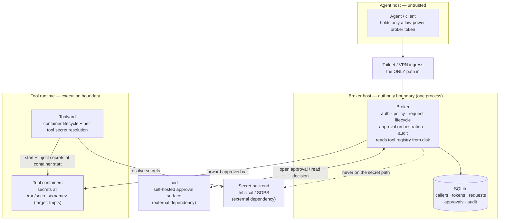

# Toolstack — Project Plan

The component-by-component architecture reference for the system — the module
seams, the security invariants, and the per-component design. Read
[PROJECT.md](PROJECT.md) for the nerve-center summary.

**Architecture direction:** collapse the logical decomposition to
*deployment reality*. The fine-grained ownership rules from the earlier 9-service
decomposition survive — but as **module seams inside one broker process**, not as
separate network services. Security comes from physical boundaries you can point
at, not from rules written between co-equal boxes.

---

## The one idea

> **Trust agents with action, not access.**
> The agent can *ask*. The broker *decides*. Tools *execute*. Secrets live with
> the tools. The agent can reach the broker and nothing else.

Full reasoning lives in the *Trust agents with action, not access* essay.
Everything below is in service of that one sentence.

---

## Physical picture (the boundary *is* the architecture)



A college student should be able to read that and say: *"The agent can only reach
the broker over the tunnel. The broker checks who you are and whether you're
allowed. Risky stuff goes to nod for a human to approve. Approved calls get
forwarded to a tool running in a container. The tool gets its own secrets from a
vault — the broker never touches them."* If they can't, the diagram is wrong.

---

## Deployable components

Four things you build, three things you deploy — plus the **agent client**
([client/](client/)): a generic `toolstack` CLI + skill that discovers and calls
tools through the broker (lazy discovery, optional per-domain skills).

### You build these

| Component | Language | Target size | Storage | Role |
|---|---|---|---|---|
| **Broker** | Python | ~800–1200 LOC | one SQLite file | Authority boundary. The only thing the agent can address. |
| **Toolyard** | Python | ~300–500 LOC | filesystem + tmpfs | Execution boundary. Container lifecycle + per-tool secret resolution. |
| **Tool template** | any | ~50–150 LOC | per-tool | What a new tool needs to wire up. A convention, not a service. |
| **Approval adapter** | Python | ~150–250 LOC | none | A *module inside the broker* that speaks to nod. Plus a contract doc so others can swap in their own surface. |

### You deploy these (external dependencies)

| Dependency | What it is | Why it's external |
|---|---|---|
| **nod** | [batteryshark/nod](https://github.com/batteryshark/nod) — self-hosted approval surface (single Rust binary, Tailscale-native, signed decisions, durable audit) | Already built and proven. The broker calls it through an adapter; it is not ours to maintain inside the stack. |
| **Secret backend** | Infisical or SOPS | Workload secrets belong with the workload, resolved by toolyard. Pluggable. |
| **Tailnet** | Tailscale Serve (or any VPN) | The ingress boundary. Not code — topology. |

The big simplification from the old design: **nod replaces the Discord bot
*and* a future web approval UI**, so there is no separate approver process to
build, deploy, or babysit. The approver becomes ~200 LOC inside the broker that
opens a nod decision and polls it for the result.

---

## Where the 9-service decomposition went

The earlier decomposition did real, useful work identifying *seams*. None of it
is lost — it just stops being a distributed system. Every logical owner keeps its
"owns / must not" rules as an internal module boundary.

| Earlier logical service | New home | Notes |
|---|---|---|
| `BrokerGateway` | Broker → **Gateway** module | Ingress/egress, correlation id. |
| `ClientProfileService` | Broker → **Identity** module | Simplified to the proven **caller** model (caller + hashed token). Profiles deferred — see below. |
| `RequestService` | Broker → **Request lifecycle** module | Owns mutable request state + orchestration. |
| `PolicyService` | Broker → **Policy** module | allow / review / deny, default-deny, grants + TTL. |
| `ToolRegistryService` | Broker → **Registry-read** loader | Demoted from a service to a `toolyard.toml` reader. Stays secret-unaware *physically* (it never reads the `[[secrets]]` block). |
| `ApprovalService` | Broker → **Approval orchestration** module | Owns approval *truth*; the surface is just a messenger. |
| `Approval Surface Endpoint` | Broker → **Approval adapter** module | The nod adapter. Pluggable via the contract doc. |
| `EventLoggingService` | Broker → **Audit** module | Append-only table in the broker's SQLite. |
| `ToolRuntimeService` | **Toolyard** | Execution + runtime prep. |
| `SecretsManagementService` (workload half) | **Toolyard** | Secrets resolved at container start. Where they physically belong. |
| `SecretsManagementService` (component-credential half) | **Deferred** | Premature. Localhost + tailnet first; service identity/mTLS only if modules ever split across hosts. |
| `Control Panel` | `brokerctl` CLI + nod's admin panel | No bespoke admin UI to build. |

---

## Cross-cutting invariants (the security spine)

Check **every** component against this list. These are the controls; the rest is
plumbing.

1. **Fail closed.** Unknown caller, expired token, no matching policy rule,
   timed-out approval, unreachable tool → **deny**. Unhelpful before unsafe.
2. **Secrets never touch the control plane.** The broker cannot read workload
   secrets. It does not inject auth into tool calls. (Testable: the broker has no
   secret-backend credential at all.)
3. **The registry is secret-unaware — physically.** The broker parses tool/op/
   risk/port from `toolyard.toml` and *ignores the `[[secrets]]` block*. (Testable:
   the broker's in-memory registry never contains a secret descriptor.)
4. **Redact before any boundary.** Arguments and results are redacted before they
   enter audit *or* an approval prompt. Raw tokens are never logged; fingerprints
   are non-reversible.
5. **Tokens are hashed at rest. Revocation is immediate** and takes effect at the
   next request step, including in-flight.
6. **Approval describes the operation, not the command.** "Approve `media.skip`
   for caller `hermes`," not "Approve `curl`?" — with caller, tool, op, target,
   data class, risk, and policy decision.
7. **The broker owns approval truth.** nod is a messenger. A nod decision is a
   *claim*; the broker validates it, reconciles against nod's durable decision
   read, and enforces its own timeout. Late decisions after broker expiry are
   ignored.
8. **Every decision is auditable and answers four questions:** what did the agent
   ask for, what was decided and by whom, what actually ran, which credential
   made it possible.

---

## Component plans

### A. Broker

**Role:** the authority boundary. The only address the agent has.

**Owns:** callers, hashed tokens, caller policy, request lifecycle, approval
truth, the audit log, and an in-memory registry read from `toolyard.toml`.

**Must not:** execute tool code · resolve or proxy workload secrets · hold a
secret-backend credential · parse MCP beyond the method/op name for audit · host
a bespoke web UI.

**Internal modules (the seams):**

| Module | Responsibility | Must not |
|---|---|---|
| Gateway | HTTP ingress, response shape, correlation id | Decide policy; touch secrets |
| Identity | callers, hashed tokens, validation, revocation | Decide tool authorization |
| Policy | allow / review / deny, default-deny, grants + TTL | Materialize secrets; execute |
| Registry-read | parse non-secret tool/op/risk/port from `toolyard.toml` | Read the `[[secrets]]` block |
| Request lifecycle | mutable request state + orchestration | Authenticate raw tokens; touch secrets |
| Approval orchestration | pending approvals, timeouts, normalized outcomes | Trust a surface id as authority |
| Approval adapter (nod) | open / read-decision / cancel against nod | Own approval truth |
| Audit | append-only event store in SQLite | Make authorization decisions |

> In code, *Approval orchestration* (timeouts, gating, normalized outcomes) lives in
> `request_lifecycle.py`; `approval.py` holds the card/state types and `surface_nod.py`
> is the nod adapter. The rows above are responsibilities, not one file each.

**HTTP surface (as built):**

```text
GET  /v1/health                         # only unauthenticated route
GET  /v1/tools, /v1/tools/<tool>.<op>   # discovery (policy-filtered to the caller)
POST /v1/actions/<tool>.<op>            # 200 ran · 202 review · 403 denied · 404 unknown · 429 rate-limited · 502 tool failed · 503 no surface
GET  /v1/requests/<id>                  # poll a request (owner only): status + result + approver/note
# operator actions (callers/policies/tokens/audit) = brokerctl on the host, not HTTP
# POST /mcp — broker-native MCP (JSON-RPC), same auth/policy/audit
# no approval callback route: resolution is poll-only (nod callbacks are unauthenticated, so a receiver would be forgeable)
```

**SQLite shape (grows by phase):** `callers`, `tokens` (hashed),
`caller_policies`, `action_requests`, `approvals`, `audit_events`. One file at
`${XDG_STATE_HOME:-~/.local/state}/toolstack/broker/broker.sqlite3`.

**Build checklist:** Phase-1 core → Phase-2 registry-read + forwarding → Phase-3
approval modules → Phase-4 admin/CLI.

**Tests (boundaries, not trivia):** unknown/expired/revoked token; default-deny;
allow path; review path; tool-unreachable → 502; redaction of args in audit;
registry never carries secret descriptors.

**Sound when:** the four audit questions are answerable for any request, and every
invariant above has at least one test.

---

### B. Toolyard

**Role:** the execution boundary and the per-tool secret boundary.

**Owns:** container lifecycle, the `toolyard.toml` source of truth, and resolving
each tool's secrets *at container start* into tmpfs.

**Must not:** make authorization decisions · be reachable by the agent · expose
one tool's secrets to another · persist resolved secret values to host disk · sit
in the request path (the broker calls the tool container directly).

**`toolyard.toml` (source of truth for both toolyard and the broker's registry-read; stdlib `tomllib`, zero-dep):**

```toml
id = "echo"
type = "api"

[entrypoint]
command = "python3 app.py"   # process backend (dev/CI)
port = 4601
# image = "ghcr.io/..."      # docker backend (production)

[[operations]]               # read by the broker's registry (op + risk)
name = "say"
risk = "read"

[[secrets]]                  # READ BY TOOLYARD ONLY — the broker never parses this
name = "api_key"             # -> $TOOLSTACK_SECRETS_DIR/api_key (default /run/secrets)
field = "API_KEY"
```

**Secret resolution:** at start, the toolyard resolves each declared secret from a
pluggable backend (Phase 2 ships a dev TOML `FileBackend`; SOPS/Infisical plug in
behind the same `resolve()` interface) and places the values where the tool reads
them. Two runners: **process** (zero-infra; secrets in a private `0700` dir via
`$TOOLSTACK_SECRETS_DIR`) and **docker** (secrets at `/run/secrets`, host port
published to loopback only). The broker never receives a secret value.

**Lifecycle commands:** `up [id]` · `down [id]` · `ls` (via `python3 -m toolyard.cli`).

**Tests:** config parse; backend resolves declared secrets / missing secret raises;
process-runner e2e (broker forwards to the started tool, the tool reads its secret,
the secret never appears in the broker); docker-runner e2e (opt-in).

**Sound when:** a tool starts, reads its secret from its secrets dir, the broker
forwards an approved call to it on `127.0.0.1:port`, and the broker never sees the
secret. ✅ Done (process + docker backends).

---

### C. Tool template

**Role:** show what a new tool needs. Onboarding a tool is "drop a folder with a
`toolyard.toml`, pick an entry point, run `toolyard up`."

**Convention:** read secrets from files —

```python
def secret(name: str) -> str:
    with open(f"/run/secrets/{name}", encoding="utf-8") as f:
        return f.read().strip()
```

**Invariant (principle #8):** adding a *tool* is near-zero friction; adding
*authority* is deliberate. A new tool is **not** reachable by any agent until a
caller policy explicitly allows it.

---

### D. Deployment & ingress

**Ingress:** Tailscale Serve terminates HTTPS for `broker.<tailnet>.ts.net` and
proxies to the broker on `127.0.0.1`. The broker and all tool containers bind
localhost only. The tunnel is the only path in.

**On-disk layout:**

| Host | Holds |
|---|---|
| Broker host | SQLite state · **nod issuer token** (to open approvals). No workload-secret credential. (No callback auth secret — resolution is poll-only; there is no callback route.) |
| Toolyard host | Per-tool secret-backend identities (mode `0600`) · `toolyard.toml` files. |
| Agent host | A low-power broker token. Nothing else. |

**External deps to stand up:** tailnet · nod (mint an issuer token + a channel) ·
secret backend (Infisical/SOPS). nod's own deploy guide:
[docs/deploy.md](https://github.com/batteryshark/nod/blob/main/docs/deploy.md).

---

## Approval surface (nod + the adapter contract)

This is the piece that changed. **nod is the reference approval surface.** The
broker talks to it through a small adapter, and a contract doc lets anyone swap in
a different surface.

### The adapter interface (what the broker depends on)

The broker's approval orchestration depends on three operations. Resolution is
**poll-only** — there is no inbound callback:

| Operation | Direction | Purpose | nod implementation |
|---|---|---|---|
| `open(card, expires_at) -> ref` | broker → surface | Publish a redacted, operation-describing prompt; return an opaque handle. | `POST /api/v1/requests` → `request_id` |
| `poll(ref) -> state` | broker → surface | The **sole source of truth**: `pending` / `approved` / `rejected` / `expired`, with approver + note. | `GET /api/v1/requests/{id}/decision` |
| `cancel(ref)` | broker → surface | Withdraw a pending prompt on broker timeout or token revocation. | nod issuer cancel |
| ~~`deliver(decision)`~~ | — | **Not implemented, not planned.** A push fast-path is rejected: nod posts callbacks unauthenticated, so a broker receiver would let anyone forge an approval. | — (no callback route) |

### Data contracts

**OperationCard (broker → surface)** — redacted, safe to leave the trust zone.
Carries: caller, tool, operation, target, data class, risk, policy reason, blast
radius, links (audit/runbook), allowed actions, `expires_at`, and an idempotency
key. **Never** raw arguments or secrets.

**SurfaceDecision (surface → broker)** — normalized: `outcome`
(`approved`/`rejected`/`expired`), `approver_ref`, optional `note`, `decided_at`.
Surface-native ids and option kinds are *metadata*, not authority.

### nod mapping (concrete)

- OperationCard → `CreateDecisionRequest`: `title` = the one-sentence decision;
  `fields` = caller/tool/op/target/risk/policy; `links` = audit + runbook;
  `options` = approve / approve_with_text / reject_with_text(destructive);
  `dedupe_key` = broker `request_id` (retry-safe); `expires_at` = broker timeout;
  `notification.redact = true` so lock-screen push leaks nothing. (No `callback_url`
  is set — there is no broker callback route.)
- Decision (from the decision read) → SurfaceDecision: `option_kind`
  `approve*` → approved, `reject*` → rejected; `text` → note; `actor_user_id` →
  approver.

### Trust rules (non-negotiable)

- The **nod issuer token** lives on the broker host; never on the agent.
- **No callback route exists; `poll` is the sole source of truth.** A push
  fast-path is deliberately not built: nod posts callbacks unauthenticated (no
  signature, no shared secret), so a broker receiver would let anyone forge an
  approval. The broker reads every approval from the decision read.
- **The broker's timer is authoritative.** It fails closed on its own timeout
  regardless of nod, and ignores decisions that arrive after expiry.
- For hardened deployments, the broker may additionally require
  `decision.signature.verified == true` (nod signs decisions on-device).

Full spec for writing another adapter:
[docs/approval-surface-adapter.md](docs/approval-surface-adapter.md).

---

## Explicitly deferred (scope guard)

Deferred, not forgotten. Don't build these until a component actually needs them.

- **Profiles** (multiple policy bundles per caller) — the caller model is enough;
  add only if one caller genuinely needs distinct policies.
- **Component-to-component credential service / mTLS between modules** — localhost
  + tailnet first; only relevant if modules split across hosts.
- **Multiple simultaneous approval surfaces** — nod is the one surface; the
  adapter contract is what makes a second one *possible*, not *present*.
- **Sandboxed one-shot jobs, off-host audit replication, heuristic risk
  classification, quorum approvals** (nod `per_user` + issuer logic if ever
  needed), bulk approval.

---

## Related docs

- [PROJECT.md](PROJECT.md) — nerve center and restart point.
- [docs/component-decomposition.md](docs/component-decomposition.md) — physical
  diagram, broker internals, and trust boundaries.
- [docs/message-contracts.md](docs/message-contracts.md) — boundary wire contracts,
  standard outcomes, audit taxonomy, and redaction rules.
- [docs/approval-surface-adapter.md](docs/approval-surface-adapter.md) — the
  contract for plugging in a different approval surface.
- [docs/coding-standards.md](docs/coding-standards.md) — clean-code expectations.
